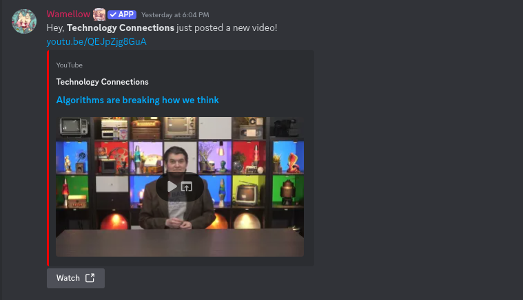

# Social Media Notifications

### Social Media Notifications - [MonitoRSS](https://monitorss.xyz/)

Mee6 recently removed notifications from its free service entirely, when all it ever was, was RSS feeds. MonitoRSS is a free and customizable, web dashboard that includes a bot for all of your RSS feeds. Simply google how to get the RSS link to your favorite internet service, and the bot will send a notification to your server within 5 minutes of it being posted! New YouTube videos, twitch streams, Reddit posts, Twitter posts, if it’s on the internet and popular enough, you’ll be sure to find an RSS feed hidden in there somewhere! Don’t pay for features as old as the internet itself!\
&#xNAN;_&#x50;rice: $0_

.png>)

### Social Media Notifications - [Pingcord](https://pingcord.xyz/)

Pingcord takes a very similar, yet automatic approach to notifications as MonitoRSS does, and allows you to add TikTok, Instagram, YouTube, Twitch, Reddit, Facebook & Twitter notifications to your server. Where it lacks though is in its premium locked Spotify notification service and the 'coming soon' nature of custom RSS feeds, which is what MonitoRSS is perfect for. It is still however an easy-to-use notification tool for those who just want to be pinged and aren't too bothered about how it looks.\
&#xNAN;_&#x50;rice: $0_

### Social Media Notifications - [Wamellow](https://wamellow.com/docs/notifications)

Wamellow lets you add some of the most popular social media platforms, such as YouTube, Twitch, Bluesky (Twitter/X clone) and Reddit. It lets you setup custom messages and embeds with over 40 unique placeholders, post filters using regex and content types and more\
&#xNAN;_&#x50;rice: $0_

<figure><figcaption>
Social Media Notifications Wamellow
</figcaption></figure>
